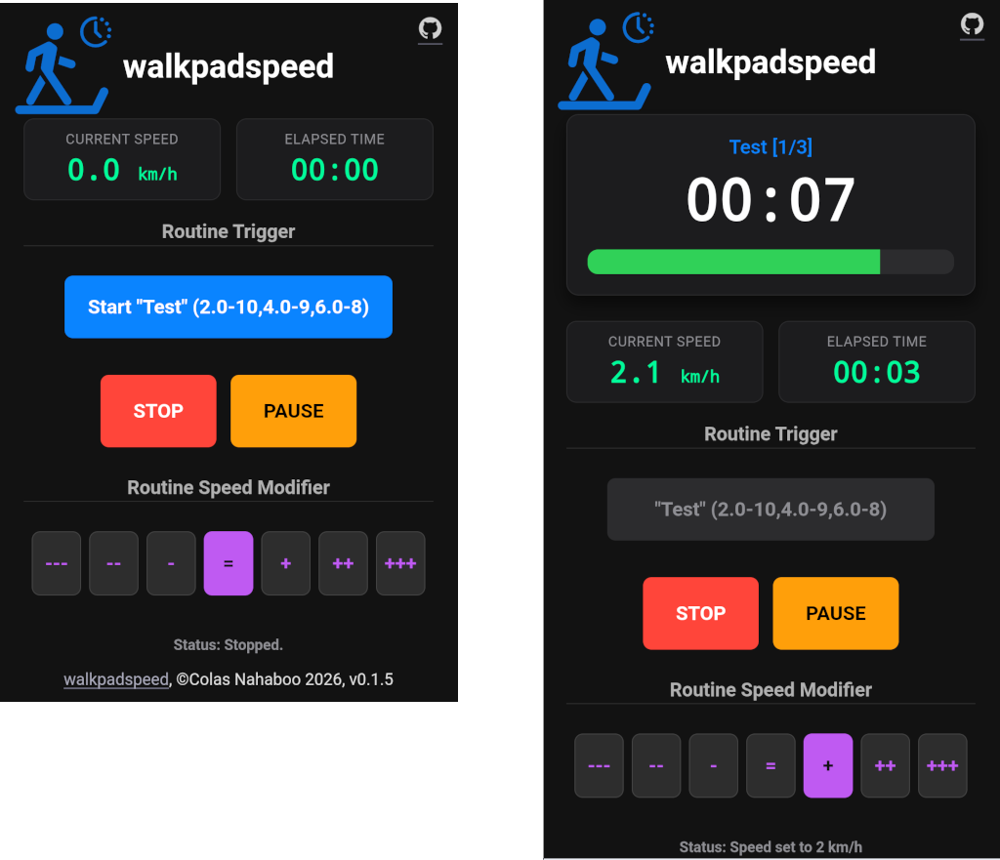

# walkpadspeed

A simple HTML page to program the speed intervals of walking pad workouts over the standard  FTMS Bluetooth protocol.

(**Quickstart:** Open https://walkpad.fr in Google Chrome on your phone or tablet)

I bought a simple, entry level walking pad (A Fousae ZX-390), because I wanted something less bulky than a treadmill, easy to install and store away, and for the same price I favored mechanical qualities over sophisticated features. And thus on such simple pads, the speed is the only thing that apps can remote control (no automatic incline setting...), and there are no sensors (heart rate...). But  all the good ones implement a subset of the standard [FTMS (Fitness Machine Service) Bluetooth protocol](https://www.bluetooth.com/specifications/specs/fitness-machine-service-1-0/).

I wanted however an app where it was easy to program various routines, as it was my first pad, and I wanted to experiment a lot with the possible routines. I discovered that apps either required expensive subscriptions, or were super complex to program. or had bugs because they tried to cater to very complex treadmills of to provide full health tracking plans. 

[MyHomeFit](https://myhomefit.de/) was the closest I could find to satisfy my needs, but writing programs in their XML format or built-in editor was horrible, and it could not manage simply setting a speed, as speeds drifted because it was relying on data from the device and trying to perform complex computations and accumulated rounding errors in the process.

## Features

So I designed walkpadspeed to ["scratch my own itch"](https://dev.to/lirena00/scratch-your-own-itch-how-to-build-and-ship-50a9) and create an app that would be useful for me, and I think all the people like me wanting freedom to control simply their simple walking pads. An application that would be:

- **setting speeds** only.
- **easy to program** routines as series of "steps", where the pad runs at some speed for some time.
- **easy to manage** these programs, by having them is a simple terse text form, to edit easily in any editor, and not some XML abomination.
- **easy to install** as it consists of only a single HTML file (embedding CSS and modern vanilla javascript code) that you just open in your phone browser (if supported, see Requirements below) or any computer with Bluetooth capabilities.
- **easy to use** simple controls implementing my needs simply.
- **opiniotated** keep bloat away by refusing to add non-essential features that could be found in other, more complex apps.

**Requirements**

- The browser on your phone or computer must support [Web Bluetooth](https://github.com/WebBluetoothCG/web-bluetooth#web-bluetooth). Currently: Google Chrome, Samsung Internet, Opera, Opera Mobile, Microsoft Edge, Vivaldi, Brave, Bluefy, BLE Link, WebBLE... but currently **not Firefox** (although some [extensions](https://addons.mozilla.org/en-US/firefox/addon/webbt/) exist). See the [current state of Web Bluetooth browser support](https://github.com/WebBluetoothCG/web-bluetooth/blob/main/implementation-status.md).
- A walking pad or treadmill supporting standard BLE FTMS (most modern ones do).

## Usage: Programming a Routine

You can just use the [walkpadspeed.html](https://colasnahaboo.github.io/walkpadspeed/walkpadspeed.html) file of this repository directly, without installing anything, by using its GitHub pages URL from Google Chrome on your phone: 

[https://colasnahaboo.github.io/walkpadspeed/walkpadspeed.html](https://colasnahaboo.github.io/walkpadspeed/walkpadspeed.html)

You can then launch automated custom workouts by passing URL parameters (`r` for the routine blueprint and `n` for the routine name). Characters not alphanumeric nor hyphen, underscore, dot or tilde must be URL-encoded (E.g. `/` becomes `%2f`). Underscores (`_`) in names will be converted to spaces for convenience, and you can use hyphens in names, e.g: `step-2`

- A routine is a comma-separated list of steps.
- A step is a hyphen-separated list of
  - A speed in km/h, a number with one decimal after the dot. E.g: 2.5, 4.6, 5.0 ...
  - A duration in seconds, a number. E.g: 120, 150, 300 ...
  - An optional label, a text that cannot contain comma. E.g: warmup, light_walk, sprint-jog ...

Examples of routines: 

1. https://colasnahaboo.github.io/walkpadspeed/walkpadspeed.html?n=My_routine&r=2.5-120-warmup,4.6-150-light_walk,5.0-300,3.1-30
2. https://colasnahaboo.github.io/walkpadspeed/walkpadspeed.html?n=Fat_Burn&r=3.0-10-Warm_Up,4.5-15-Interval-1,6.0-120-Last_Effort

The second query string above, which also shows that you can host a walkpadspeed page on a Github repository, automatically creates a 3-step sequence:

1. **Warm Up**: `3.0 km/h` for 10 seconds.
2. **Interval-1**: `4.5 km/h` for 15 seconds.
3. **Last Effort**: `6.0 km/h` for 120 seconds.

You can then bookmark these URLs or write them on any editable page (a wiki, a Google doc, ...) to create your library of routines.

### The UI

The left screenshot below show the application ready to start, and the right one, the routine running.

The **Routine speed modifiers** dynamically changes all the programmed speeds of a routine by -20%, -10%, -5%, none, +5%, +10%, +20%. Durations are unchanged, and they can be set before starting the routine, or during it.
This is useful if during a routine you feel that the speeds are actually too slow or too fast for your current fitness.
For instance, pressing the `++` modifier button on the second example routine above will transform it into:

1. **Warm Up**: `3.3 km/h` for 10 seconds.
2. **Interval-1**: `4.9 km/h` for 15 seconds.
3. **Last Effort**: `6.6 km/h` for 120 seconds.

 

**Test mode**: by using the  `t=1` URL parameter, you enter test mode, where walkpadspeed fakes a Bluetooth connection and runs without connecting or sending anything to any walking pad. This allows to see how the UI behaves without having to install and start your walking pad.
For instance, you can test it now at [https://colasnahaboo.github.io/walkpadspeed/walkpadspeed.html?t=1](https://colasnahaboo.github.io/walkpadspeed/walkpadspeed.html?t=1) 

## Optional: Installation & Deployment

If you do not want to use the walkpadspeed.html hosted here, and want to host it yourself, since the interface is entirely self-contained inside a single file, setup is minimal:

1. Clone this repository or just download the single file `walkpadspeed.html`.
2. Deploy the file to any web server or service (e.g., Apache, Nginx, a Wiki or GitHub Pages).
3. Access the file using your browser on your Bluetooth-enabled device (your phone, tablet, computer...) over an `https://` connection.

## Implementation

- **Pure modern Javascript** is used to interpret your routine, use the browser Web Bluetooth API and manage the timers to send the steps to drive your walking pad.
- **Bluetooth FTMS Integration:** Connects directly via Web Bluetooth API to native Fitness Machine Service characteristics (`0x1826`).
- **Dynamic URL Routines (`?r=`)**: Configure custom interval training profiles directly in the URL bar, complete with speeds, durations, and descriptive step names.
- **Persistent Screen State:** Leverages the modern Browser Screen Wake Lock API to prevent devices from dimming or going blank during workouts.
- **Audio Cues:** Features low-latency predictive audio chime indicators generated via the Web Audio API precisely 1 second prior to interval changes.
- **Precise Timer Mechanics:** High-accuracy state machine managing active countdown intervals, automated variable motor warm-up delays (`spinUpTime`), and live metric tracking.

Hardware Support & Core Blueprint: This control system operates across standard FTMS profile architectures:

* **Service UUID:** `0x1826` (Fitness Machine Service)
* **Control Characteristic:** `0x2AD9` (Machine Control Point)
* **Live Telemetry Stream:** `0x2ACD` (Treadmill Data)

## Future developments

Bugs and suggestions are always welcome, but know that I will resist adding features that would add complexity and bloat. I will definitely not add any sensor tracking like heart rate, or systems to manage tracking your training of planning a series of workouts.

The only features I plan to add would be:

- Usability enhancements
- Support for some hardware quirks
- Support for driving walkpads with automatic incline setting, if the need actually exists. I already have an outline of the implementation in `docs/incline-feature.md`.

## License

© Colas Nahaboo, 2026. MIT license, that means that you can do anything with it, but expect no warranty. Some help from Gemini and Z.ai.

## History

- v0.3.6 2026-06-22 back to a single file performing both function: manager of a library of routines and player of one.
- v0.2.7 2026-06-21 new file walkpadspeeds.html to manage a set of routines from a text file description.
- v0.1.0 2026-06-20 initial working version.
