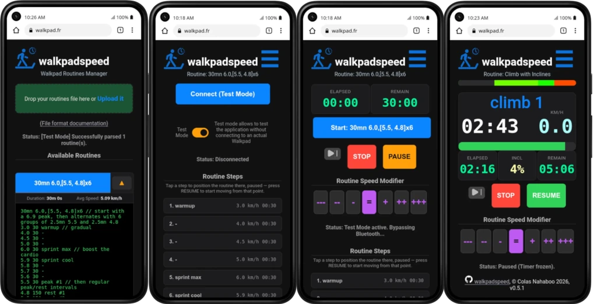
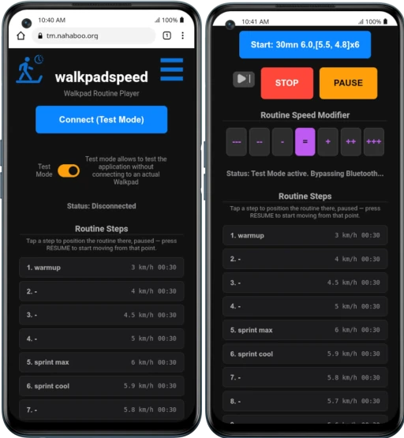
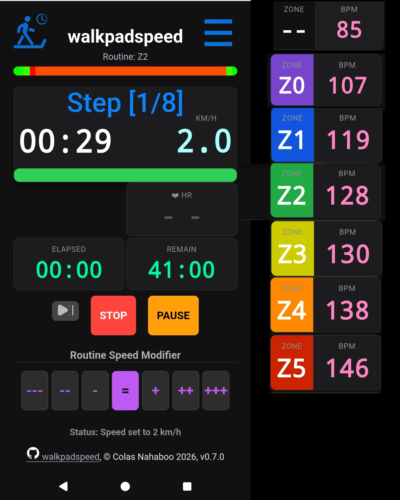
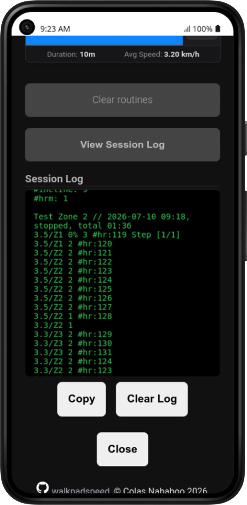

# walkpadspeed

Control your Bluetooth walking pad from your phone or computer without installing anything, and run your own custom interval routines from simple text files. **The walkpad app for geeks!**

(**Quickstart:** Open https://walkpad.fr in Google Chrome on your phone or tablet)

**walkpadspeed** is a single web page (no app store, no install, no account, no ads) that connects to a "smart" walking pad / treadmill over Bluetooth and drives it through a workout you design yourself: Create walking routines on your computer, load them onto your phone, and let the app handle the timer and speed changes for you!

## What can it do?

- **Connect to your walkpad over Bluetooth** directly from your browser — no extra app needed.
- **Use your heart monitoring device** if it uses the standard "BLE Heart Rate Service", e.g: Coros, Coospo, Garmin, Polar, Wahoo...
- **Allow to Design your own routines** (aka "routines") as a simple text file with a list of speeds and durations, and optionally incline changes. Walkpadspeed has an open design, it does not jail you behing cumbersome interfaces or proprietary protocoles or APIs.
- **Auto-adjust the speed** of the trackpad to keep your heart rate in a specific zone.
- **Pause, resume, or stop** at any time, from the app or from your walkpad's own physical remote.
- **Nudge the whole workout faster or slower** on the fly, without restarting it. Nice to follow the same routine, but at a different pace depending on how you feel this day.
- **(Re)Start the routine at any step** if you want to change to a different routine mid-workout, or mistakenly quit the routine.
- **Try it out in "Test Mode"** with no walkpad at all, to see how everything works first.
- **Keep a log of past sessions** as a simple text file in the same format as the routines file.

### What it won't do

- Manage your health, or interface with systems like Google Health. Walkpadspeed does not help you to conceive or track your routines, workouts or health goals and results, it simply provides a powerfully customizable way to implement your routines.
- Provide entertainement, such as music, videos, landcapes... I use a walkpad because it allows me to watch interesting videos or series on a computer or TV screen, to keep healthy, I am not interested in focusing on my performance.

## Prerequisites

To use walkpadspeed, you need:

1. **A compatible walking pad / treadmill.** It must support Bluetooth using the standard "FTMS" (Fitness Machine) protocol. Most walking pads sold with a companion phone app (the kind without a console full of buttons) use this protocol.
2. **A smartphone or tablet with Bluetooth**: Its browser must support [Web Bluetooth](https://github.com/WebBluetoothCG/web-bluetooth#web-bluetooth). Currently: Google Chrome, Samsung Internet, Opera, Opera Mobile, Microsoft Edge, Vivaldi, Brave, Bluefy, BLE Link, WebBLE... but currently **not Firefox nor Safari** (although some [extensions](https://addons.mozilla.org/en-US/firefox/addon/webbt/) exist). See the [current state of Web Bluetooth browser support](https://github.com/WebBluetoothCG/web-bluetooth/blob/main/implementation-status.md).
3. Optionally, a heart tracking device using the standard "BLE Heart Rate Service", e.g: Coros, Coospo, Garmin, Polar, Wahoo...

## What does it looks like?

[](docs/screens-v0.5.1/all-big.webp)

<table width="100%">
  <colgroup>
    <col style="width:25%">
    <col style="width:25%">
    <col style="width:25%">
    <col style="width:25%">
  </colgroup>

<thead>
    <tr>
    <th>Manager      </th>
    <th>Connection      </th>
    <th>Routine Ready    </th>
    <th>Routine Playing    </th>
    </tr>
  </thead>

<tbody>
    <tr>
      <td>You load your routines text file, and the manager lets you choose one to play, and see its source file definition</td>
      <td>You connect to your Walking Pad via Bluetooth.</td>
      <td>The routine is now ready to play; click on the blue button with its name.</td>
      <td>Routine started, now Walk! This screenshot is of a routine that displays the incline, as the chosen routins defined them.</td>
    </tr>
  </tbody>
</table>

### 2. Opening the App

You can just use the [walkpadspeed.html](https://colasnahaboo.github.io/walkpadspeed/walkpadspeed.html) file of this repository directly, without installing anything, by using its GitHub pages URL from Google Chrome on your phone.
Alternatively, you can also open [https://walkpad.fr](https://walkpad.fr) which is easier to enter in your phone browser, but you cannot load routines files from a GitHub Gist (see below) this way.

Save it in your phone browser bookmarks!

### 3. Connecting to Your Machine

1. Turn on your walking pad or treadmill.
2. Click the **Connect Walkpad** button at the top of the screen. \
   **Enabling Test mode** allows you tu run the application without any walkpad connected, to see how the application works, and to test your created routines.
3. A browser window will pop up listing nearby Bluetooth devices. Select your treadmill from the list and click **Pair** or **Connect**.
4. Once connected, your live speed, distance, and time will appear on the screen, as well as big button to start your routine.

## Step 1 — Write your routines

Routines ("routines") are written in a plain text file you create yourself (in any text editor — Notepad, TextEdit, Notes, etc.) and save as `.txt` (or `.wps` if you prefer).

**The rules are simple:**

- Each workout starts with a **name** on its own line.
- Every line after that is one **step** of space-separated values:
  - **speed**, a number which can have a decimal, expressed in **km/h**. Note that all the walkpads use km/h internally anyways, since the bluetooth protocol imposes km/h as the speed unit, not mph. \
    To express a speed in miles per hour, just append **mph** to it.\
    - **speed/Zone** If you are using a Heart Rate Monitor, the speed is ignored, and the pad speed will be progressively dynamically adjusted every 20s so that your heart rate stays in the chosen zone. E.g: `4.2/Z2 10m`, `3mph/Z4 1m`, `3.0/Z0 120`
    - **speed>Zone** The pad is set to speed until either the Zone or the duration is reached. E.g: `5.5>Z2 2m` is a way to force a brisk 5.5 km/h pace getting into Zone 2 at the end of the warmup, without overdoing it and entering Zone 3.
  - **incline** (optional) a percent of incline as an integer postfixed by `%`.
  - **duration** of the step, a number (integer) of seconds. Can also be expressed in minutes if immediatelly followed by `mn` or `m`.
  - **name** (optional) You can optionally add a label after the duration, to name that step (e.g. "Warmup").
- **blank lines** separates the routines in the file.
- **Comments:** Lines starting with `#` or `//` are notes for yourself and are ignored, as is anything after `//` on a line.
- Some optional (global settings) can be specified at the start of the file as `Hname: value` lines.
  - `#name:` your name, for displaying in messages, e.g. Colas.
  - `#hrm:` set it to 0 (default: 1) to remove the Heart Rate Monitor (HRM) [(see below)](#heart-rate-monitoring) display, useful if you never use one.
  - `#rest-heart-rate:` your heart rate at rest, e.g. `70`. Used for HRM zones.
  - `#max-heart-rate:` you maximum heart rate, normally 220 (men) or 226 (women) minus your age, e.g. if you are a 50yo man, `170`. But it can vary. Used for HRTM zones. See also [various methods to calculate it](https://journals.viamedica.pl/folia_cardiologica/article/view/92507).
  - `#speed-unit:` if set to `mph`, all the speeds will be interpreted as mph instead of km/h by default in the routines files.
  - `#max-speed:` normally the maximum speed of the pad is read over Bluetooth. If the pad does not publish it, you can set it via this metadata, e.g: `#max-speed: 6.0`. Default is `12`.
  - `#min-speed:` normally the minimum speed of the pad is read over Bluetooth. If the pad does not publish it, you can set it via this metadata, e.g: `#min-speed: 1.2`. Default is `1.0`.
  - `#step-length:` the length in meters of one of your steps at 3 km/h. Measure it by walking on your pad at 3.0 km/h, and counting the number `N` of your steps done in 30 seconds. Your step length is then `25 / N`. E.g. for 42 steps counted, enter `#step-length: 0.60`. Note that your step length on a walking pad may differ from your natural step length when walking outside. Walkpadspeed with then adjust the actual step length to use in the session log, as it changes with the speed by the formula: `steplen-at-3kmh * (speed / 3)^0.42`. Defaults to `0.62`.
  - `#export-logs-url:` provides an optional URL of a web server that the application will POST to the log of a session after termination of a routine. See [Auto export of logs](#auto-export-of-logs).

**Example file:**

```
Morning small jog
3.0 5mn Warmup
5.0mph 10m // 5mph ⇒ 8.0 km/h
3.0 120 Cooldown

HIIT Sprints
// short, intense intervals: 30s sprint 30s recover
3 60 Warmup
6 30 sprint #1
3 30
6 30 sprint #2
3 30
6 30 sprint #3
3 2m Cooldown

Climb some hills // for walkpads with automatic incline change
3 120 warmup
5.0 4% 180 climb_1
4.0 60 flat
5.5 6% 180 climb_2
4.0 60 flat
3 0% 120 cooldown
```

This file describes two separate routines: a 17-minute steady walk, and an interval session that alternates between walking and jogging speed.

Save the file and keep it handy — you'll upload it on the Manager screen.

**Note:** As I do not have a walkpad with automatic incline setting, the code to drive the incline on the pad should work, but is not actually tested. Feedback welcome!

**Share your routines!** Feel free to share your routines with others as [discussions](https://github.com/ColasNahaboo/walkpadspeed/discussions/categories/your-routines) on this repository!

**Use AI!** I strongly advise using AIs to design your routines. You can ask it questions like: *What is the optimal range of heart rate (in % of max) for lowering glycemic levels in a postprandial exercise of 10 to 15mn on a walking pad at 9% incline? Can you write me a walkpadspeed routine for this?*
It provides you detailed explanations and even can write the routines for you (you may have to copy/paste this file format doc if needed).

## Step 2 — Load your routines (Manager screen)

1. Open walkpadspeed. You'll land on the **Manager** screen.
2. **Drag your text file onto the box**, or click the box to choose the file from your device.
3. The page reads your file and lists every routine it found, each as its own button, also computing and showing:
   - its total **duration**, and
   - its **average speed**.
4. Click the little **▼** next to a routine to peek at the raw text the app read for it — handy for double-checking your file if something looks off.

Your file is automatically remembered by the browser, so the next time you open walkpadspeed on the same device, your routines are already there — you don't need to re-upload it every time.

**Tip:** Each routine button is actually a unique link containing the whole routine. You can bookmark it, or share it with someone else — they don't need your original file, the link has everything baked in.

### Loading your routines from a GitHub Gist

You can also maintain your routines file in a <a href='https://gist.github.com/'>GitHub Gist</a>, a simple way to publish texts on the web:

1. Paste your routines files into a public Gist (not a secret one)
2. Copy the URL of your Gist 
3. On walkpadspeed click the button "Import from a copied URL of a Gist"
4. walkpadspeed will then load the routines, and change its URL to memorize the gist URL as a `gist` URL parameter
5. You can then bookmark this URL. This way you can edit your routines in your gist, running walkpadspeed from this bookmark will automatically reload it!

**Note:** In principle, this could be done with any way to store a text file on the web at some URL. In practice, we use Gist because it is specifically designed to allow other web apps to import its contents, as modern browsers tend to have security rules preventing this. 

**Example of use:**

- I create a new Gist at https://gist.github.com/
- I get one at URL https://gist.github.com/ColasNahaboo/058bbe224c26b5c157bbc3d30225a18b
- I paste my routines file into it (the ones in `docs/colas-routines.txt`)
- I clone this gist locally as it is a Github repository:\
  `git clone git@gist.github.com:058bbe224c26b5c157bbc3d30225a18b.git ~/git/walkpadspeed-colas-routines` \
  See the script I use: `docs/colas-routines-publish.sh`
- I can thus edit my routines at will here and publish them by a:\
  `git commit -ma "routines published"`
- On my phone, I do once:
  - I open https://gists.github.com in a browser, go to the gist, **copy** its URL which is: https://gist.github.com/ColasNahaboo/058bbe224c26b5c157bbc3d30225a18b
  - I open the [walkpadspeed.html](https://colasnahaboo.github.io/walkpadspeed/walkpadspeed.html) app, and click on the "Import from a copied URL of a Gist" button
  - I see that the routines are loaded, and I bookmark this page.
- I open walkpadspeed by using the bookmark I created above.

### Loading your routines from a web site

You can also host your routines file in the same way, but as a text file of a web server, but it will work only if it is in the same domain, due to the security restrictions of browsers. E.g.

- if you host a copy of `walkpadspeed.html` at https://my.domain.net/somewhere.../walkpadspeed.html
- you can copy the URL of the routines if you host the file at  https://my.domain.net/anywhere.../my-routines.txt

## Step 3 — Run a routine (Player screen)

Click any routine button on the Manager screen to jump to the **Player** screen, pre-loaded with that routine.

1. Press **Connect to WalkPad**. Your browser will ask you to pick your device from a list — choose your walkpad and approve the connection.
2. Once connected, you'll see live numbers:
   - **Incline** - a percentage if the routine has any incline changes defined
   - **❤ HR** - the heart rate monitor, if not disabled by `#hrm: 0`. If you wear one, **connect to it** by clicking on the indicator (the `- -`). Re-clicking disconnects.
   - **Elapsed** — how long you've been moving
   - **Speed** — your pad's current actual speed
   - **Remain** — how much time is left in the whole routine
3. Press the big blue button (named after your routine) to **start**. The pad will begin moving and speed up/slow down automatically on schedule.
4. A thin **progress bar** above shows the whole routine at a glance — colored from green (slower, easier sections) to red (faster, harder sections) — with the elapsed portion "wiped clean" as you go.
5. You'll hear a short **beep one second before** every speed change, so you're never caught off guard.

### While a routine is running

- **PAUSE / RESUME** — freezes or restarts the clock and the pad. You can also pause or resume directly using your walkpad's own physical remote control — walkpadspeed notices the speed change and keeps itself in sync automatically.

- **STOP** — ends the routine and stops the pad completely.

- **Routine Speed Modifier** (the `--- -- - = + ++ +++` row) — lets you scale every speed in the routine up or down on the fly, without losing your place:
  
  | Button | Effect             |
  | ------ | ------------------ |
  | `---`  | 20% slower         |
  | `--`   | 10% slower         |
  | `-`    | 5% slower          |
  | `=`    | Normal (no change) |
  | `+`    | 5% faster          |
  | `++`   | 10% faster         |
  | `+++`  | 20% faster         |
  
  Feeling great today? Tap `+`. Tired? Tap `-`. The whole rest of the routine adjusts immediately.

Tap the **☰** menu in the top-right corner at any time to go back to the Manager screen and pick a different routine.

### While a routine is paused

You can jump directly to any routine step by clicking on the list or "Routine steps" that appear at the bottom on the connection screen, or on the Player screen when the routine is stopped.



## Heart rate monitoring

An **❤ HR** display is available under the speed display.
If you wear an heart rate monitoring system (armband, chest band, smart watch...), you can activate at any time the **❤ HR** display by clicking onto it. The indicator will display your heart rate as a number of beats per minute, with the [cardio zone](https://learn.beyondpulse.com/blog/the-five-zones-of-heart-rate-training/) to its left.

Walkpadspeed adds a pseudo zone "digestive" Z0 before the Z1 zone, for the optimal digestive effort to reduce glycemic peaks after meals.

* **Z0 (38–50% | Digestive/Glucose | Purple):** Optimizes postprandial glycemic control by actively clearing glucose from the bloodstream through light muscle contractions after meals.
* **Z1 (50–60% | Recovery/Light | Blue):** Promotes active recovery and boosts circulation to help flush out metabolic waste without placing additional stress on the body.
* **Z2 (60–70% | Aerobic/Fat Burn | Green):** Maximizes fat oxidation and builds a robust mitochondrial foundation to improve your baseline aerobic efficiency.
* **Z3 (70–80% | Endurance | Yellow):** Enhances overall cardiovascular capacity and stamina, training the heart and lungs to sustain moderate efforts for longer periods.
* **Z4 (80–90% | Threshold | Orange):** Raises your lactate threshold, teaching your body to buffer metabolic byproducts and maintain higher speeds before hitting fatigue.
* **Z5 (90–100% | VO2 Max | Red):** Develops peak anaerobic power, maximum cardiac output, and your absolute aerobic ceiling (VO2 max) using short, high-intensity efforts.

Here is how the **❤ HR** display, initially empty on the left view, will appear in different zones:



The zone indicator also shows two meters (bars) on each side that show where in the zone we currently are:


## Log of past sessions

On the manager screen, you can see the log of past sessions in the same format as the routines file, but listing actual recordings for speed, zone, incline, heart rate...
The heart rate, if monitored, is added at the start of the step name, in the form `#hr:BPM` where BPM is the pulse (beats per minute) number. E.g: `#hr:119`

You can copy this file to where you want to store it, as it is only kept in the local storage of the browser having run the session. This fined-grained log is especially useful when using a Heart Rate Monitor device, to finely tune the routines to your specific needs and goals.

The log consist of:

- The metadata that were defined during the routine
- The name of the routine, and a `//`-prefdied comment with the date and time of the session, if it has completed, and the total duration and the walked distance in km.
- the recordings

For instance:

```
#name: Colas
#rest-heart-rate: 70
#max-heart-rate: 154
#version: 1
#incline: 9
#hrm: 1

Short Digestive // 2026-07-10 08:31, completed, total 12:00
2.5 9% 1 #hr:84 Step [1/3]
2.5 2 #hr:85
2.5 1 #hr:87
2.5 8 #hr:86
4.1 1 #hr:100
4.4 7
4.4 10 #hr:101
4.4/Z0 4 #hr:102
```

And a screenshot:



Note: this format has changed since v0.8.0.

### Auto export of logs

Setting `#export-logs-url:` provides an optional URL of a web server that the application will POST to the log of a session after termination of a routine. You can then code a simple web service to receive these logs and store them as you want.

What will be sent will be a text file with:
- the current metadata
- the totals of the day: duration, distance, steps
- the log of the last routine

For instance, you can use the free service at [ntfy.sh](https://ntfy.sh/) to push your logs.
1. choose a name for your topic on ntfy. E.g.: `my-wps-logs` or better something not guessable, such as `a2yqEgifY6S7Jk3kJpsOYwo` as this will serve as your password, being a  [Capability URLs](https://www.w3.org/TR/capability-urls/).
2. add the metadata to your routines files:  `#export-logs-url: https://ntfy.sh/my-wps-logs`
3. you can then see all your routines logs at `https://ntfy.sh/my-wps-logs`

```
#name: Colas
#rest-heart-rate: 70
#max-heart-rate: 154
...

// 2026-07-23 Day totals: 55 mn, 2.963 km, 6092 steps

Test Mode Zone 2 // 2026-07-23 22:52, stopped, total 00:19, 0.023 km, 42 steps
4.3/Z1 9% 3 #hr:119 10m
4.3/Z2 2 #hr:120
4.3/Z2 2 #hr:121
4.3/Z2 2 #hr:122
4.3/Z2 2 #hr:123
4.3/Z2 2 #hr:124
4.3/Z2 2 #hr:125
4.3/Z2 2 #hr:126
4.3/Z2 2 #hr:127
```

And here is a simple bash CGI script you can use on any web server to store logs via  `#export-logs-url:`:

``` bash
#!/bin/bash

echo $'Content-Type: text/plain\n'
[[ "$REQUEST_METHOD" != "POST" ]] && { echo "ERROR: POST only"; exit 1;}

LOGFILE="logswps/$(date +%Y-%m).log"
{ echo $'\n========================================'; cat;} >> "$LOGFILE"
```

---

## Test Mode — try it without a walkpad

Don't have your walkpad on hand, or just want to see how the app behaves first? Flip on **Test Mode** on either screen.

- On the Manager screen, it adds a small marker to your routine links so they open in Test Mode too.
- On the Player screen, "Connect" pretends to connect instantly — no real Bluetooth needed — and a small ▶/⏸ button appears so you can simulate pressing your walkpad's physical remote, to check that pause/resume detection behaves correctly.

This is purely a practice/preview mode — it won't move anything, since there's nothing real to move.

Note: you can also simulate an heart rate monitor device, see below "Optional: Installation & Deployment"

---

## Troubleshooting

**"Connect to WalkPad" does nothing, or my browser says Bluetooth isn't supported.**
Make sure you're using Chrome or Edge on a computer or Android device. iPhones and Safari cannot do this yet.

**My walkpad doesn't show up in the device list.**
Make sure it's powered on and not already connected to another phone/app — most walkpads can only pair with one device at a time. Also confirm it supports the FTMS Bluetooth standard; some very basic models don't.

**"No valid routines detected in file."**
Double check each routine has a name line followed by at least one step line, and that step lines look like `speed duration` (e.g. `5 60`), with a blank line between separate routines.

Note: to access the browser console to see internal log messages, use the "Console" toggle switch at the bottom of the manager view.

## Privacy

Everything happens entirely inside your browser. Your routine file, your Bluetooth connection, and your routine history never leave your device — there's no server, no account, and no tracking.

## Why walkpadspeed?

I bought a simple, entry level walking pad (A [Fousae ZX-390](https://www.youtube.com/watch?v=PrnlVPZXXoY), but many brands sell similar pads: Urevo, Sperax, DeerRun, Costway...), because I wanted something less bulky than a treadmill, easy to install and store away, and for the same price I favored mechanical qualities over sophisticated features. And thus on such simple pads, the speed is the only thing that apps can remote control (with automatic incline setting on some models), and there are no sensors (heart rate...). But  all the good ones implement a subset of the standard [FTMS (Fitness Machine Service) Bluetooth protocol](https://www.bluetooth.com/specifications/specs/fitness-machine-service-1-0/).

I wanted however an app where it was easy to program various routines, as it was my first pad, and I wanted to experiment a lot with the possible routines. I discovered that apps either required expensive subscriptions, or were super complex to program. or had bugs because they tried to cater to very complex treadmills of to provide full health tracking plans. 

[MyHomeFit](https://myhomefit.de/) was the closest I could find to satisfy my needs, but writing programs in their XML format or built-in editor was horrible (you cannot even duplicate a routine or a step), and it could not manage simply setting a speed, as speeds drifted because it was relying on data from the device and trying to perform complex computations and accumulated rounding errors in the process.

So I designed walkpadspeed to ["scratch my own itch"](https://dev.to/lirena00/scratch-your-own-itch-how-to-build-and-ship-50a9) and create an app that would be useful for me, and I think all the people like me wanting freedom to control simply their simple walking pads.

- **setting speeds and inclines** only.
- **easy to program** routines as series of "steps", where the pad runs at some speed and incline for some time.
- **easy to manage** these programs, by having them is a simple terse text form, to edit easily in any editor, and not some XML abomination.
- **easy to install** as it consists of only a single HTML file (embedding CSS and modern vanilla javascript code) that you just open in your phone browser (if supported, see Requirements below) or any computer with Bluetooth capabilities. And I can also host a version for the whole world to use directly from this github repo or my server at https://walkpad.fr since hosting a single static web page is so light.
- **easy to use** simple controls implementing my needs simply.
- **opiniotated** keep bloat away by refusing to add non-essential features that could be found in other, more complex apps.

### Future developments

Bugs and suggestions are always welcome, but know that I will resist adding features that would add complexity and bloat.

The only features I plan to add currently would be:

- Bug fixes, obiously.
- Usability enhancements.
- Support for some hardware quirks when reported, if possible.
- Export of the log data in a CSV format that can be used in Health tracking systems like Google Health. 

## Optional: Installation & Deployment

If you do not want to use the walkpadspeed.html hosted here or on walkpad.fr, host a version modified for your needs, since the interface is entirely self-contained inside a single file, setup is minimal:

1. Clone this repository or just download the single file `walkpadspeed.html`.
2. Deploy the file to any web server or service (e.g., Apache, Nginx, a Wiki or GitHub Pages).
3. Access the file using your browser on your Bluetooth-enabled device (your phone, tablet, computer...) over an `https://` connection. E.g: `https://my-domain.org/walkpad/wps.html`

**Heart rate monitor simulation** In test mode (enabled by a switch in the manager view), you can also simulate an hear rate monitor device, such as an armband or chest band. For this, you need to make a text file `hr.txt` that will be downloadable at the same place  as the application is hosted. In the example above, `https://my-domain.org/walkpad/hr.txt`

The file must contain lines of pairs of number: the pulse (bpm) to report and the time in seconds from the start of the tested routine at which it is reached. Empty lines and comments (lines starting with `#` are ignored). For instance:

```
70 0
80 10
90 25
100 43
102 48
105 60
```

See the one I use in [docs/hr.txt](docs/hr.txt).

## Implementation

- **Pure modern Javascript** is used to interpret your routine, use the browser Web Bluetooth API and manage the timers to send the steps to drive your walking pad.
- **Standard HTML + CSS + Javascript** a.k.a Vanilla Web Development (or simply "Vanilla JS").
- **Bluetooth FTMS Integration:** Connects directly via Web Bluetooth API to native Fitness Machine Service characteristics (`0x1826`).
- **Dynamic URL Routines (`?r=`)**: The Manager passes the routine definition as URL parameters n (routine name), t (test mode), and r the complete definition of the routine.
- **Persistent Storage:** Leverages the modern Browser Screen to store your loaded routines locally, soo you do not have to re-load them each time.
- **Audio Cues:** Features low-latency predictive audio chime indicators generated via the Web Audio API precisely 1 second prior to interval changes.
- **Precise Timer Mechanics:** High-accuracy state machine managing active countdown intervals, automated variable motor warm-up delays (`spinUpTime`), and live metric tracking.
- **Flexible operation** You can at any time before or during a routine slow it down or speed it up without restarting it. Also if in mid-routine you realise you'd prefer another one, you can just start the other routine from any of its  steps, you are not forced to start it from the beginning.

Hardware Support & Core Blueprint: This control system operates across standard FTMS profile architectures:

* **Service UUID:** `0x1826` (Fitness Machine Service)
* **Control Characteristic:** `0x2AD9` (Machine Control Point)
* **Live Telemetry Stream:** `0x2ACD` (Treadmill Data)

## License

© Colas Nahaboo, 2026. MIT license, that means that you can do anything with it, but expect no warranty. SVG icons are derived from the ones at [svgrepo](https://www.svgrepo.com) with a MIT license.

## AI Co-Design Disclosure


This repository is developed by me, a human hobbyist in my personal time in close collaboration with various AI programming assistants. System architecture, logic design, and final reviews are handled by me, while code scaffolding, repetitive tasks, and standard styling are co-piloted by AI. AI contributions are commited under their model name, and can be quite verbose for tracability.

## History

- v0.8.8 2026-07-23 #exports-log-url metadata to upload the logs after a routine to a server of your choice.
- v0.8.7 2026-07-21
  - #min-speed metadata, the app now only enter pause mode if the pad speed gets below this value. Zones auto-adjust was messing with the previous auto-detection.
  - if speed field is speed>zone, run till we reach the zone, and then immediately go text step.
- v0.8.6 2026-07-19 log also prints the total steps in a session. Use #step-length: to customize.
- v0.8.5 2026-07-18 log also prints the total walked distance in a session.
- v0.8.4 2026-07-18 pad max speed read, can also be set  via #max-speed.
- v0.8.3 2026-07-15 more auto-adjust tuning by examining logs
- v0.8.2 2026-07-15 auto-adjust tuning: symmetric ±0.2 nudges, EMA trend decay faster, trend-aware brake ported into the maintenance phase. getHRZone now uses the same BPM-rounded bounds as the speed control (single source of truth).
- v0.8.1 2026-07-14 auto-adjust is a bit more reactive to slow the speed. Fixed incline now properly set in the logs.
- v0.8.0 2026-07-10 new log format: now uses the routines files format, and is super detailed, tracking every heart rate change
- v0.7.5 2026-07-08 new auto-adjust algorithm based on physiological data.
- v0.7.4 2026-07-07 small meters on each side of the Zone indicator. HRM simulation in test mode.
- v0.7.3 2026-07-06 tweaked the zone-targeting algorithm.
- v0.7.2 2026-07-05 speeds can be specified also with a target Zone. New Z0 zone for digestive walks (38-50% HRR)
- v0.7.1 2026-07-05 heart rate display is disabled if metadata `#hrm: 0` is in the routines file.
- v0.7.0 2026-07-04 tracks the heart rate with any device using the standard BLE heart_rate service (I use a coros armband)
- v0.6.4 2026-07-03 released. When launching a routine, if the walkpad is not connected anymore (e.g. app is resumed after some hours), show the connection screen instead of running disconnected.
- v0.6.3 2026-06-30 released. prevent hardware jitters to trigger pauses during slowest step.
- v0.6.2 2026-06-30 routines file can be loaded from a GitHub Gist. setting a modifier now changes the speed immediately without waiting for the next step to begin.
- v0.6.1 2026-06-29 released. in the routines files, durations can be specified in minutes, and speeds in mph.
- v0.6.0 2026-06-28 released. Log sessions as Markdown texts shown on the manager screen, that you can then copy into your personal log.
- v0.5.1 2026-06-27 released. Cleaned up the UI.
- v0.5.0 2026-06-27 Support for inclines. But Untested on real walkpads.
- v0.4.2 2026-06-26 released. You can now (re)start to any routine step.
- v0.4.1 2026-06-25 released. This implements all the features I wanted initially.
- v0.4.0 2026-06-25 works consistently with the physical play/pause button on the remote.
- v0.3.6 2026-06-22 back to a single file performing both functions: manager of a library of routines and player of one.
- v0.2.7 2026-06-21 new file walkpadspeeds.html, the Routines Manager, to manage a set of routines from a text file description.
- v0.1.6 2026-06-21 released. I now use only walkpadspeed for my workouts.
- v0.1.0 2026-06-20 initial working version.
