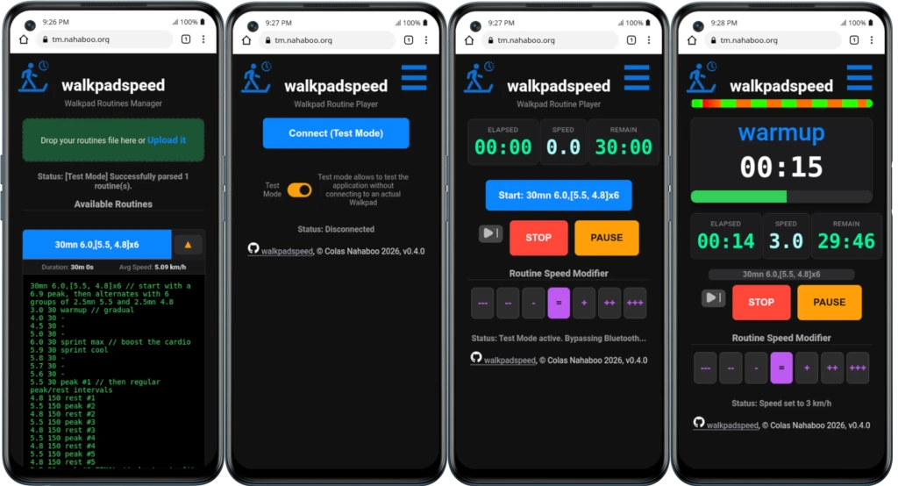

# walkpadspeed

Control your Bluetooth walking pad from your phone or computer without installing anything, and run your own custom interval routines from simple text files.

(**Quickstart:** Open https://walkpad.fr in Google Chrome on your phone or tablet)

**walkpadspeed** is a single web page (no app store, no install, no account, no ads) that connects to a "smart" walking pad / treadmill over Bluetooth and drives it through a workout you design yourself: Create walking routines on your computer, load them onto your phone, and let the app handle the timer and speed changes for you!

## What can it do?

- **Connect to your walkpad over Bluetooth** directly from your browser — no extra app needed.
- **Design your own routines** (aka "routines") as a simple text file with a list of speeds and durations.
- **Pause, resume, or stop** at any time, from the app or from your walkpad's own physical remote.
- **Nudge the whole workout faster or slower** on the fly, without restarting it. Nice to follow the same routine, but at a different pace depending on how you feel this day.
- **Try it out in "Test Mode"** with no walkpad at all, to see how everything works first.

## Prerequisites

To use walkpadspeed, you need:

1. **A compatible walking pad / treadmill.** It must support Bluetooth using the standard "FTMS" (Fitness Machine) protocol. Most walking pads sold with a companion phone app (the kind without a console full of buttons) use this protocol.
2. **A smartphone or tablet with Bluetooth**: Its browser must support [Web Bluetooth](https://github.com/WebBluetoothCG/web-bluetooth#web-bluetooth). Currently: Google Chrome, Samsung Internet, Opera, Opera Mobile, Microsoft Edge, Vivaldi, Brave, Bluefy, BLE Link, WebBLE... but currently **not Firefox nor Safari** (although some [extensions](https://addons.mozilla.org/en-US/firefox/addon/webbt/) exist). See the [current state of Web Bluetooth browser support](https://github.com/WebBluetoothCG/web-bluetooth/blob/main/implementation-status.md).

## What does it looks like?

[](docs/screens-v0.4.0/all.webp)

<table width="100%">
  <colgroup>
    <col style="width:25%">
    <col style="width:25%">
    <col style="width:25%">
    <col style="width:25%">
  </colgroup>

  <thead>
    <tr>
    <th>Manager&nbsp;&nbsp;&nbsp;&nbsp;&nbsp;&nbsp;</th>
    <th>Connection&nbsp;&nbsp;&nbsp;&nbsp;&nbsp;&nbsp;</th>
    <th>Routine Ready&nbsp;&nbsp;&nbsp;&nbsp;</th>
    <th>Routine Playing&nbsp;&nbsp;&nbsp;&nbsp;</th>
    </tr>
  </thead>

  <tbody>
    <tr>
      <td>You load your routines text file, and the manager lets you choose one to play.</td>
      <td>You connect to your Walking Pad via Bluetooth.</td>
      <td>The routine is now ready to play; click on the blue button with its name.</td>
      <td>Routine started, now Walk!</td>
    </tr>
  </tbody>
</table>

### 2. Opening the App

You can just use the [walkpadspeed.html](https://colasnahaboo.github.io/walkpadspeed/walkpadspeed.html) file of this repository directly, without installing anything, by using its GitHub pages URL from Google Chrome on your phone.
Alternatively, you can also open [https://walkpad.fr](https://walkpad.fr) which is easier to enter in your phone browser.

Save it in your phone browser bookmarks!

### 3. Connecting to Your Machine

1. Turn on your walking pad or treadmill.
2. Click the **Connect Walkpad** button at the top of the screen. \
   **Enabling Test mode** allows you tu run the application without any walkpad connected, to see how the application works, and to test your created routines.
3. A browser window will pop up listing nearby Bluetooth devices. Select your treadmill from the list and click **Pair** or **Connect**.
4. Once connected, your live speed, distance, and time will appear on the screen, as well as big button to start your routine.

## Step 1 — Write your routines

Routines ("routines") are written in a plain text file you create yourself (in any text editor — Notepad, TextEdit, Notes, etc.) and save as `.txt` (or `.wps` if you prefer).

**The rules are simple:**

- Each workout starts with a **name** on its own line.
- Every line after that is one **step**: a speed, then how long to hold it, separated by a space.
- Speed is in **km/h**. Duration is in **seconds**.
- You can optionally add a label after the duration, to name that step (e.g. "Warmup").
- Leave a **blank line** between two different routines.
- Lines starting with `#` or `//` are notes for yourself and are ignored, as is anything after `//` on a line.

**Example file:**

```
Morning Walk
3.0 300 Warmup
5.0 600
3.0 120 Cooldown

HIIT Sprints
// short, intense intervals: 30s sprint 30s recover
3 60 Warmup
6 30 sprint #1
3 30
6 30 sprint #2
3 30
6 30 sprint #3
3 120 Cooldown
```

This file describes two separate routines: a 17-minute steady walk, and an interval session that alternates between walking and jogging speed.

Save the file and keep it handy — you'll upload it on the Manager screen.

## Step 2 — Load your routines (Manager screen)

1. Open walkpadspeed. You'll land on the **Manager** screen.
2. **Drag your text file onto the box**, or click the box to choose the file from your device.
3. The page reads your file and lists every routine it found, each as its own button, also computing and showing:
   - its total **duration**, and
   - its **average speed**.
4. Click the little **▼** next to a routine to peek at the raw text the app read for it — handy for double-checking your file if something looks off.

Your file is automatically remembered by the browser, so the next time you open walkpadspeed on the same device, your routines are already there — you don't need to re-upload it every time.

**Tip:** Each routine button is actually a unique link containing the whole routine. You can bookmark it, or share it with someone else — they don't need your original file, the link has everything baked in.

## Step 3 — Run a routine (Player screen)

Click any routine button on the Manager screen to jump to the **Player** screen, pre-loaded with that routine.

1. Press **Connect to WalkPad**. Your browser will ask you to pick your device from a list — choose your walkpad and approve the connection.
2. Once connected, you'll see three live numbers:
   - **Elapsed** — how long you've been moving
   - **Speed** — your pad's current actual speed
   - **Remain** — how much time is left in the whole routine
3. Press the big blue button (named after your routine) to **start**. The pad will begin moving and speed up/slow down automatically on schedule.
4. A thin **progress bar** above shows the whole routine at a glance — colored from green (slower, easier sections) to red (faster, harder sections) — with the elapsed portion "wiped clean" as you go.
5. You'll hear a short **beep one second before** every speed change, so you're never caught off guard.

### While a routine is running

- **PAUSE / RESUME** — freezes or restarts the clock and the pad. You can also pause or resume directly using your walkpad's own physical remote control — walkpadspeed notices the speed change and keeps itself in sync automatically.

- **STOP** — ends the routine and stops the pad completely.

- **Routine Speed Modifier** (the `--- -- - = + ++ +++` row) — lets you scale every speed in the routine up or down on the fly, without losing your place:
  
  | Button | Effect             |
  | ------ | ------------------ |
  | `---`  | 20% slower         |
  | `--`   | 10% slower         |
  | `-`    | 5% slower          |
  | `=`    | Normal (no change) |
  | `+`    | 5% faster          |
  | `++`   | 10% faster         |
  | `+++`  | 20% faster         |
  
  Feeling great today? Tap `+`. Tired? Tap `-`. The whole rest of the routine adjusts immediately.

Tap the **☰** menu in the top-right corner at any time to go back to the Manager screen and pick a different routine.

---

## Test Mode — try it without a walkpad

Don't have your walkpad on hand, or just want to see how the app behaves first? Flip on **Test Mode** on either screen.

- On the Manager screen, it adds a small marker to your routine links so they open in Test Mode too.
- On the Player screen, "Connect" pretends to connect instantly — no real Bluetooth needed — and a small ▶/⏸ button appears so you can simulate pressing your walkpad's physical remote, to check that pause/resume detection behaves correctly.

This is purely a practice/preview mode — it won't move anything, since there's nothing real to move.

---

## Troubleshooting

**"Connect to WalkPad" does nothing, or my browser says Bluetooth isn't supported.**
Make sure you're using Chrome or Edge on a computer or Android device. iPhones and Safari cannot do this yet.

**My walkpad doesn't show up in the device list.**
Make sure it's powered on and not already connected to another phone/app — most walkpads can only pair with one device at a time. Also confirm it supports the FTMS Bluetooth standard; some very basic models don't.

**"No valid routines detected in file."**
Double check each routine has a name line followed by at least one step line, and that step lines look like `speed duration` (e.g. `5 60`), with a blank line between separate routines.

**The speed seems to ignore my Speed Modifier setting after I changed it.**
The modifier applies to the *next* speed change sent to the pad — if you're in the middle of a long step, it will apply as soon as that step ends, or you can stop and restart to apply it immediately.

## Privacy

Everything happens entirely inside your browser. Your routine file, your Bluetooth connection, and your routine history never leave your device — there's no server, no account, and no tracking.

## Why walkpadspeed?

I bought a simple, entry level walking pad (A [Fousae ZX-390](https://gemini.google.com/app/3a269a17de02ca04), but sold under many brands: Urevo, Sperax, DeerRun, Costway...), because I wanted something less bulky than a treadmill, easy to install and store away, and for the same price I favored mechanical qualities over sophisticated features. And thus on such simple pads, the speed is the only thing that apps can remote control (no automatic incline setting...), and there are no sensors (heart rate...). But  all the good ones implement a subset of the standard [FTMS (Fitness Machine Service) Bluetooth protocol](https://www.bluetooth.com/specifications/specs/fitness-machine-service-1-0/).

I wanted however an app where it was easy to program various routines, as it was my first pad, and I wanted to experiment a lot with the possible routines. I discovered that apps either required expensive subscriptions, or were super complex to program. or had bugs because they tried to cater to very complex treadmills of to provide full health tracking plans. 

[MyHomeFit](https://myhomefit.de/) was the closest I could find to satisfy my needs, but writing programs in their XML format or built-in editor was horrible, and it could not manage simply setting a speed, as speeds drifted because it was relying on data from the device and trying to perform complex computations and accumulated rounding errors in the process.

So I designed walkpadspeed to ["scratch my own itch"](https://dev.to/lirena00/scratch-your-own-itch-how-to-build-and-ship-50a9) and create an app that would be useful for me, and I think all the people like me wanting freedom to control simply their simple walking pads.

- **setting speeds** only.
- **easy to program** routines as series of "steps", where the pad runs at some speed for some time.
- **easy to manage** these programs, by having them is a simple terse text form, to edit easily in any editor, and not some XML abomination.
- **easy to install** as it consists of only a single HTML file (embedding CSS and modern vanilla javascript code) that you just open in your phone browser (if supported, see Requirements below) or any computer with Bluetooth capabilities.
- **easy to use** simple controls implementing my needs simply.
- **opiniotated** keep bloat away by refusing to add non-essential features that could be found in other, more complex apps.

### Future developments

Bugs and suggestions are always welcome, but know that I will resist adding features that would add complexity and bloat. I will definitely not add any sensor tracking like heart rate, or systems to manage tracking your training of planning a series of routines.

The only features I plan to add would be:

- Usability enhancements
- Support for some hardware quirks when reported, if possible.
- A way to go directly to a step (from the manager wiew?).
- Maybe: Support for driving walkpads with automatic incline setting, if the need actually exists, as I think people with these more sophisticaded walkpads want more complex applications to take better advantage of the functionalities available. But in any case, I already have an outline of the implementation in `docs/incline-feature.md`. Adding the incline percentage in the file format would be done as an optional step property in a backwards compatible way.

## Optional: Installation & Deployment

If you do not want to use the walkpadspeed.html hosted here or on walkpad.fr, host a version modified for your needs, since the interface is entirely self-contained inside a single file, setup is minimal:

1. Clone this repository or just download the single file `walkpadspeed.html`.
2. Deploy the file to any web server or service (e.g., Apache, Nginx, a Wiki or GitHub Pages).
3. Access the file using your browser on your Bluetooth-enabled device (your phone, tablet, computer...) over an `https://` connection.

## Implementation

- **Pure modern Javascript** is used to interpret your routine, use the browser Web Bluetooth API and manage the timers to send the steps to drive your walking pad.
- **Bluetooth FTMS Integration:** Connects directly via Web Bluetooth API to native Fitness Machine Service characteristics (`0x1826`).
- **Dynamic URL Routines (`?r=`)**: The Manager passes the routine definition as URL parameters n (routine name), t (test mode), and r the complete definition of the routine.
- **Persistent Storage:** Leverages the modern Browser Screen to store your loaded routines locally, soo you do not have to re-load them each time.
- **Audio Cues:** Features low-latency predictive audio chime indicators generated via the Web Audio API precisely 1 second prior to interval changes.
- **Precise Timer Mechanics:** High-accuracy state machine managing active countdown intervals, automated variable motor warm-up delays (`spinUpTime`), and live metric tracking.

Hardware Support & Core Blueprint: This control system operates across standard FTMS profile architectures:

* **Service UUID:** `0x1826` (Fitness Machine Service)
* **Control Characteristic:** `0x2AD9` (Machine Control Point)
* **Live Telemetry Stream:** `0x2ACD` (Treadmill Data)

## License

© Colas Nahaboo, 2026. MIT license, that means that you can do anything with it, but expect no warranty. Some help was provided by Gemini, Z.ai, and Claude. SVG icons are derived from the ones at [svgrepo](https://www.svgrepo.com) with a MIT license.

## History

- v0.4.1 2026-06-25 released. This implements all the features I wanted initially.
- v0.4.0 2026-06-25 works consistently with the physical play/pause button on the remote.
- v0.3.6 2026-06-22 back to a single file performing both functions: manager of a library of routines and player of one.
- v0.2.7 2026-06-21 new file walkpadspeeds.html, the Routines Manager, to manage a set of routines from a text file description.
- v0.1.6 2026-06-21 released. I now use only walkpadspeed for my workouts.
- v0.1.0 2026-06-20 initial working version.
