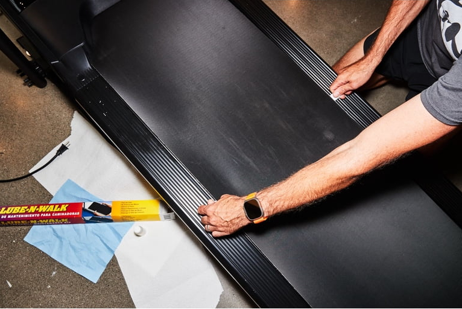

# walkpadclean

A tiny, standalone single-file web app for cleaning and oiling a **Bluetooth walking pad** belt. It works the same way as `walkpadspeed.html`, but it's a separate tool built for a single job: keep the belt spinning for a fixed amount of time so you can oil it, then stop the pad automatically. That frees both hands (which are covered in oil) to finish the job instead of holding a button down.

## How to use it

1. Open [walkpadclean.html](https://colasnahaboo.github.io/walkpadspeed/walkpadclean/walkpadclean.html) in **Google Chrome** (or any bluetooth-enabled browser) on your phone or tablet.
2. Tap **Connect to walkpad** and pick your walkpad from the Bluetooth picker.
3. Choose the duration of your cleaning pass:  **30s · 45s · 1mn · 1mn30s · 2mn**.
4. Prepare your oiling device. I use a DIY version of [lube-n-walk](https://lube-n-walk.com/): window insulation foam glued on a plastic slat.
5. Oil it, slide it under the belt.
6. Start the pad with its **physical** remote or button. Tip: put some masking tape on the button so you won't put oil on it.
7. Hold both ends of the device while the belt runs at its slowest speed to oil it. While it counts down, oil the belt along its full travel.
8. When it reaches 0, the pad stops and beeps. The belt is clean and oiled. And you did not put oil on your phone screen :-)

The app only waits, counts, and stops. You control belt speed with the pad's own remote.

## Requirements

- **Google Chrome** (Web Bluetooth is not supported in Safari or Firefox).
- The walkpad must support the standard **FTMS** (Fitness Machine) Bluetooth protocol. Most walking pads sold with a companion phone app use it.
- **HTTPS** (or `http://localhost`). Web Bluetooth does **not** work from `file://`.

## Files

- `walkpadclean.html` — the entire app (HTML + CSS + JS in one file, no dependencies). You can copy it to any HTTPS server of your choice if you want.

## Notes

- A **wake lock** keeps the screen on during a countdown.
- If the belt stops mid-countdown (you pause it manually), the app aborts and returns to the panel.
- **Cancel** is available during both the "waiting for belt to spin" phase and the countdown.
- After stopping, the app stays connected, so you can immediately run another cleaning cycle.

## How it works (Implementation)

`walkpadclean.html` uses the same FTMS BLE protocol as [`walkpadspeed.html`](https://github.com/ColasNahaboo/walkpadspeed):

- Connects to the **Fitness Machine Service** (`0x1826`).
- Reads speed from the **Fitness Machine Data** characteristic (`0x2ACD`) — flags byte + uint16 LE speed at 0.01 km/h resolution.
- Stops the pad by sending a **speed-0 command** (opcode `0x02`, speed `0`) followed by a **pause** command (opcode `0x08`).

It sends no start or speed commands — the belt is driven entirely by the pad's physical remote.

## License

MIT License, same as `walkpadspeed.html` — see the parent repository.
